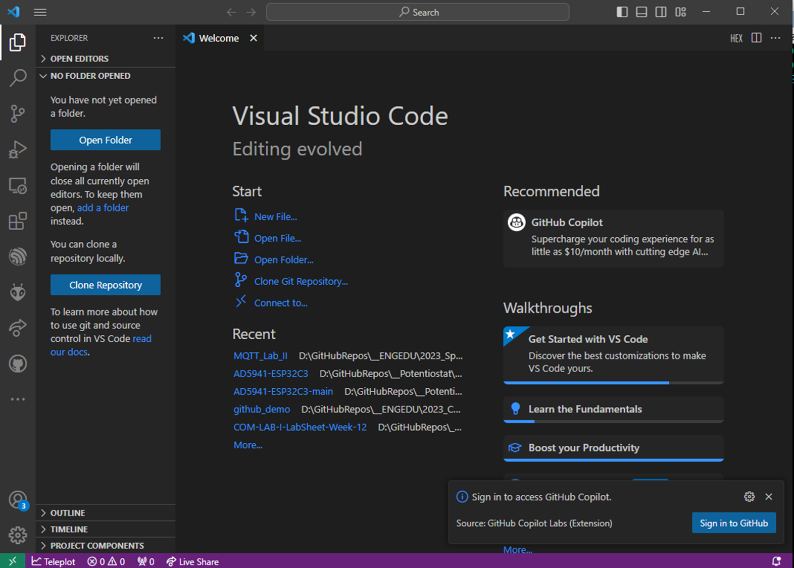
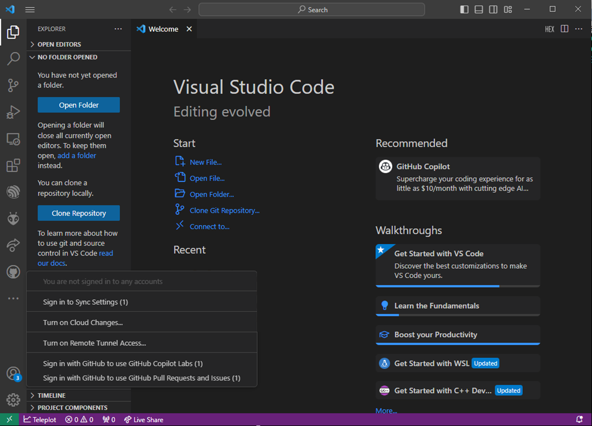
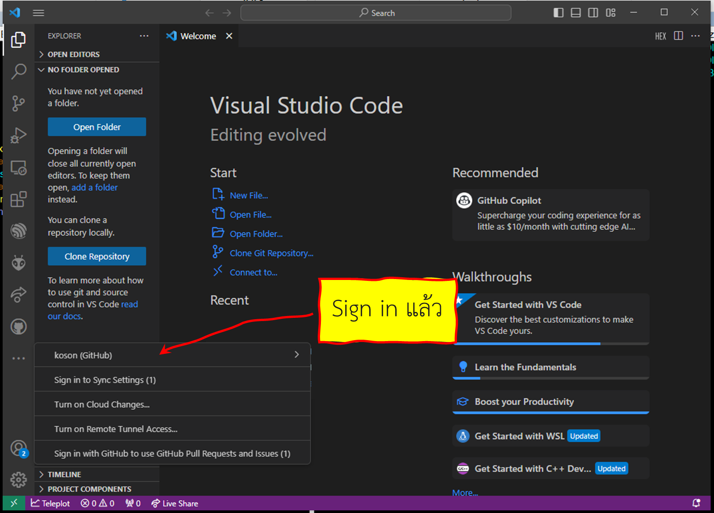
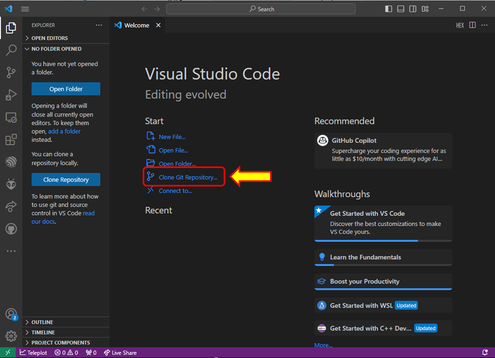
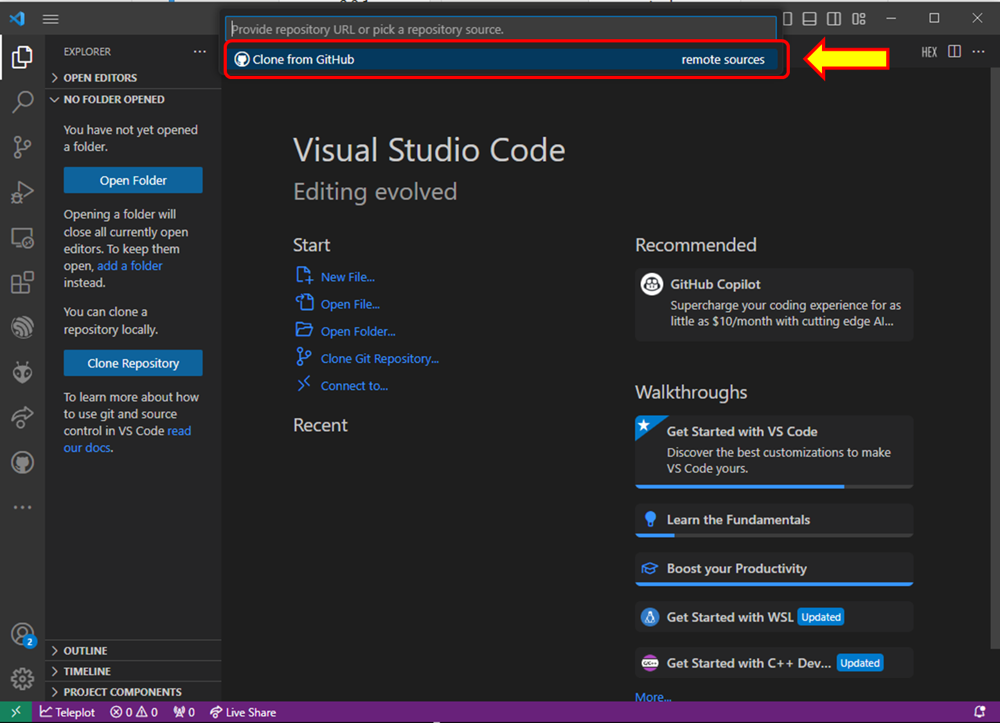
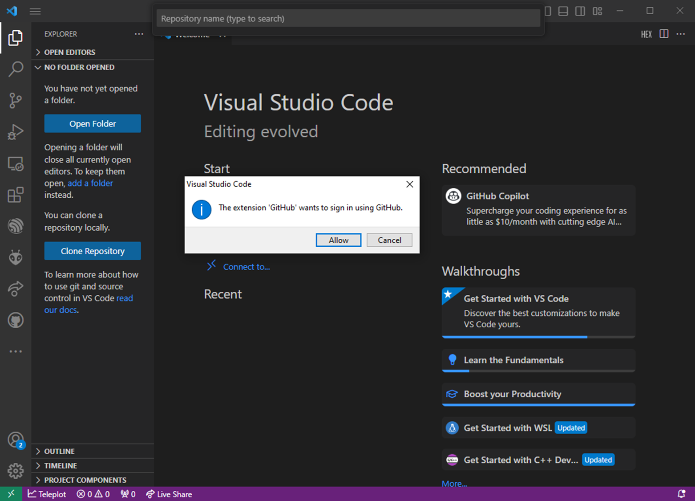
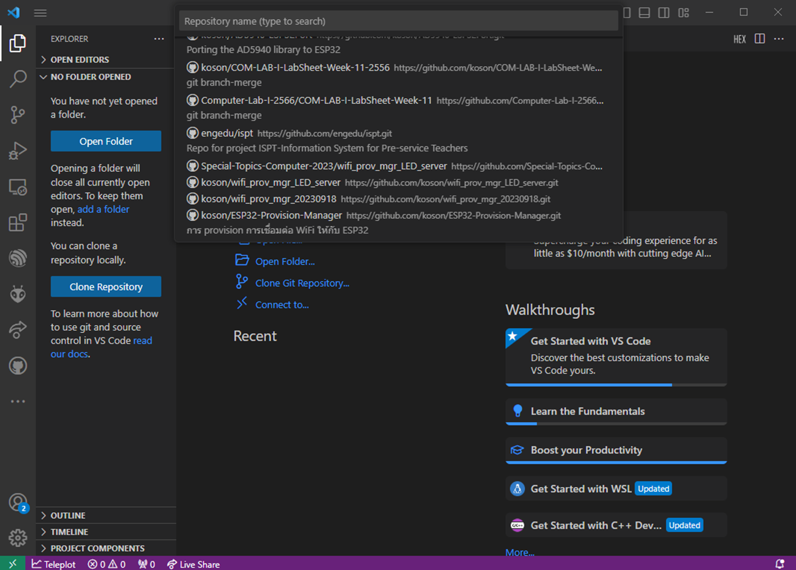
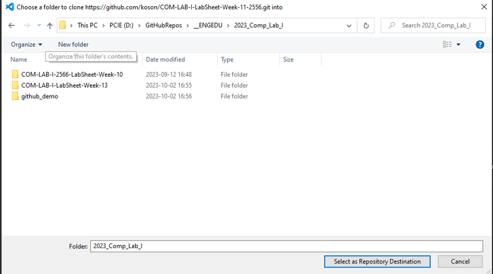
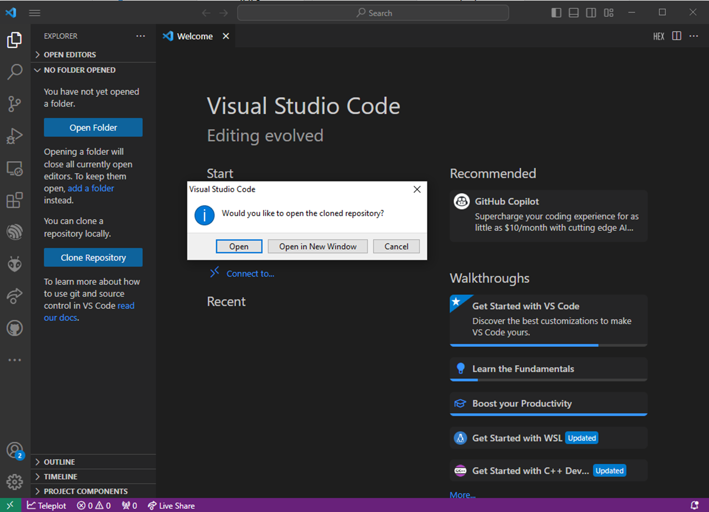
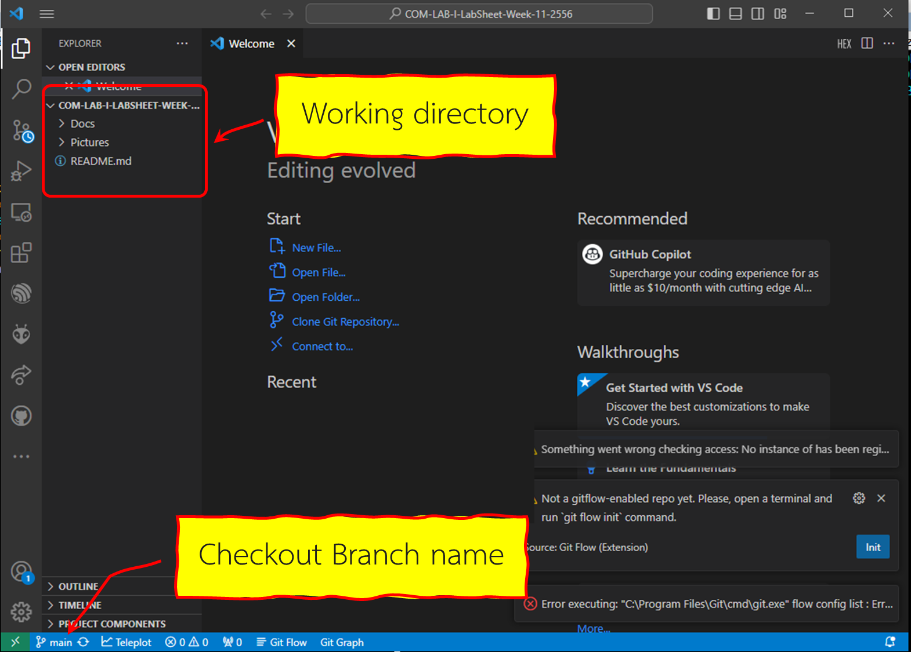

# แนะนำการใช้งาน github บน Visual studio code

1. ติดตั้งโปรแกรม VScode และเรียกขึ้นมาทำงาน

2. Sign in เข้าใช้งาน github ผ่าน VScode

3. เมื่อ Sign in เสร็จ ใน user account จะบอกให้รู้ว่าเชือมกับ github ด้วย account ใด

4. ในกรณีที่มี  repository บน github อยู่แล้วก็สามารถ clome มาได้เลย

คลิกที่ Clone Git Repository...

5. เลือก remote source เป็น Clone from GitHub

6. ถ้า Github extension ของ VSCODE ยังไม่ได้  authenthicate กับ  Github.com ก็จะปรากฏหน้าต่างให้ทำการ sign in  ซึ่งอาจจะ redirect ไปทำการ authenthicate บน web browser ให้ sign in และทำการอนุญาตให้เรียบร้อย (จะทำเพียงครั้งแรกหรือเมื่อ sign out จากเครื่องไปแล้วเท่านั้น)

7. เลือก repository ที่ต้องการ clone จาก list บน  panel ที่ VSCODE แสดง

8. เลือกที่อยู่บน harddisk ที่จะเก็บ repository  ที่ทำการ clone  ลงมา

9. 

10. 

11. 

