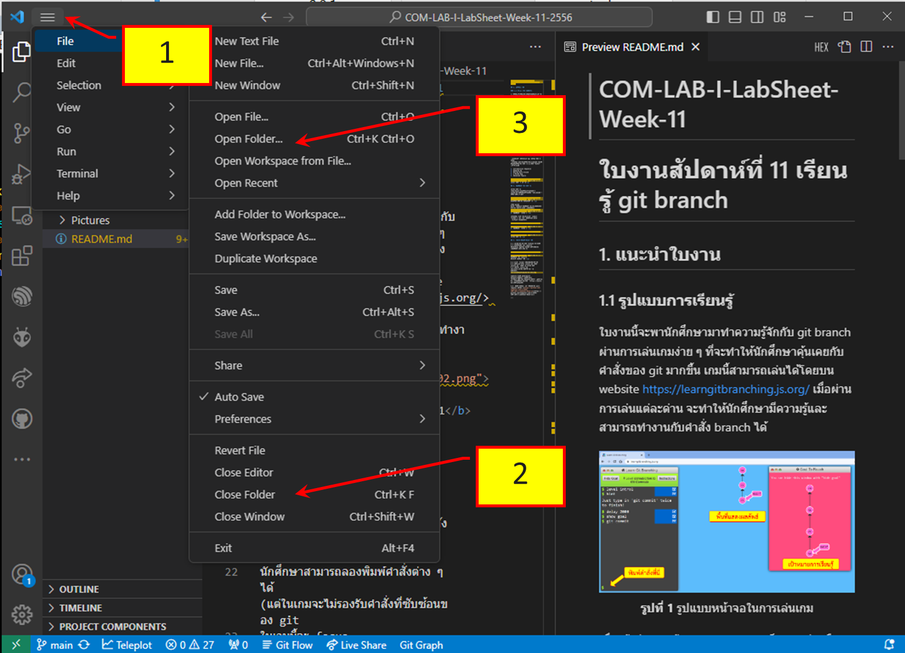
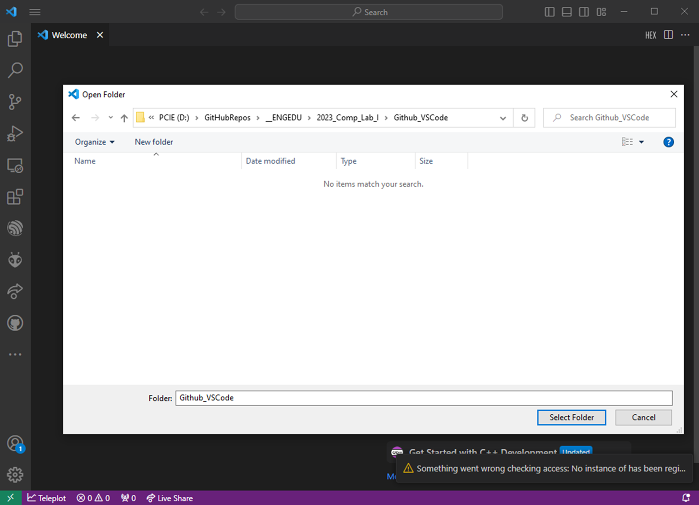
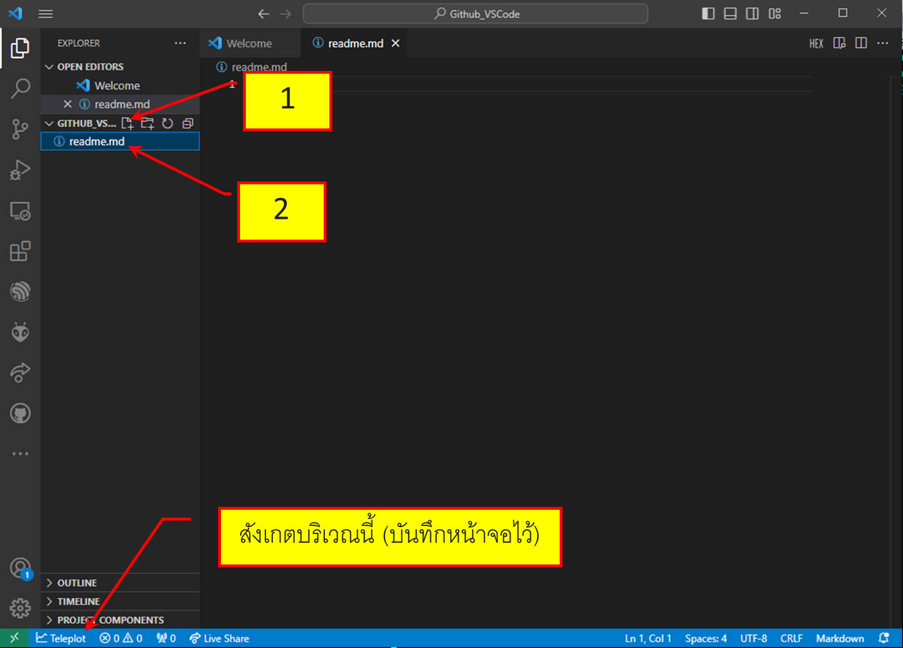
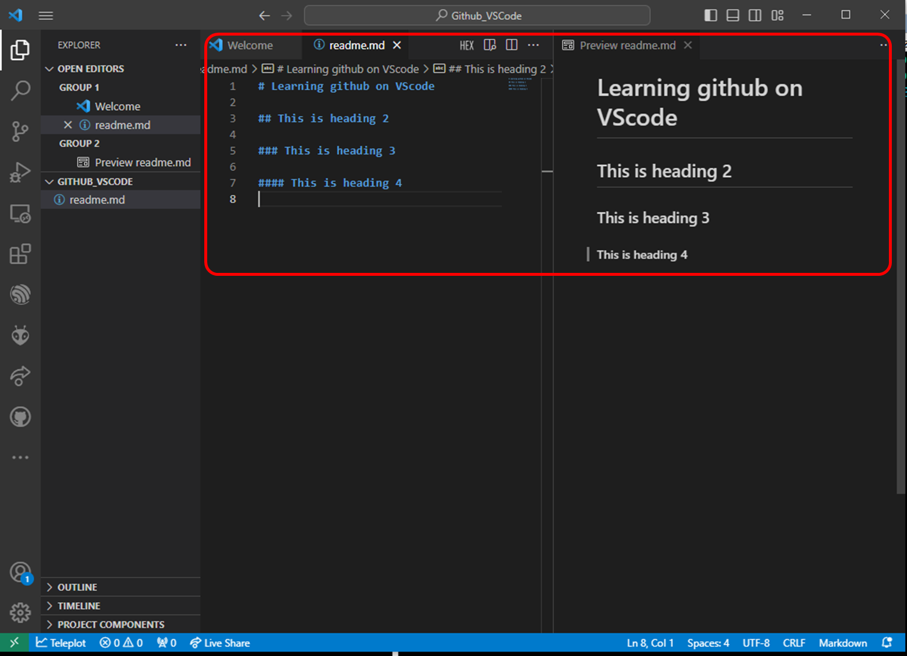
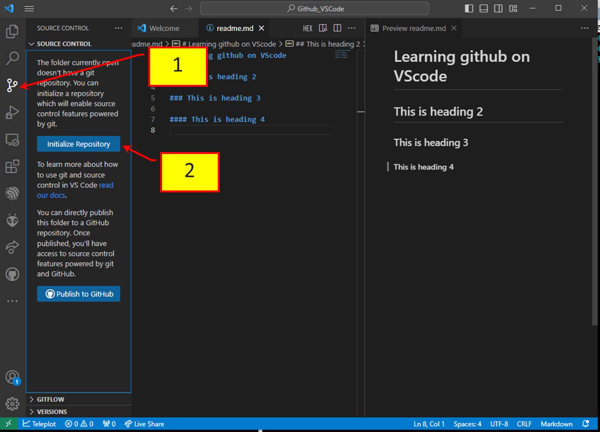
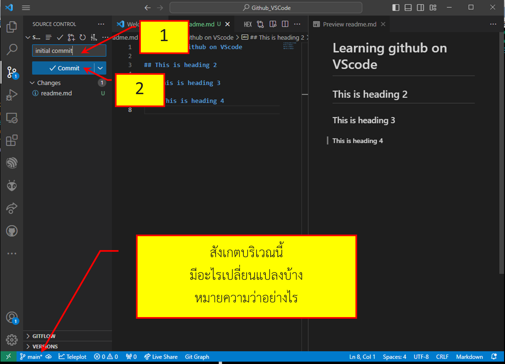
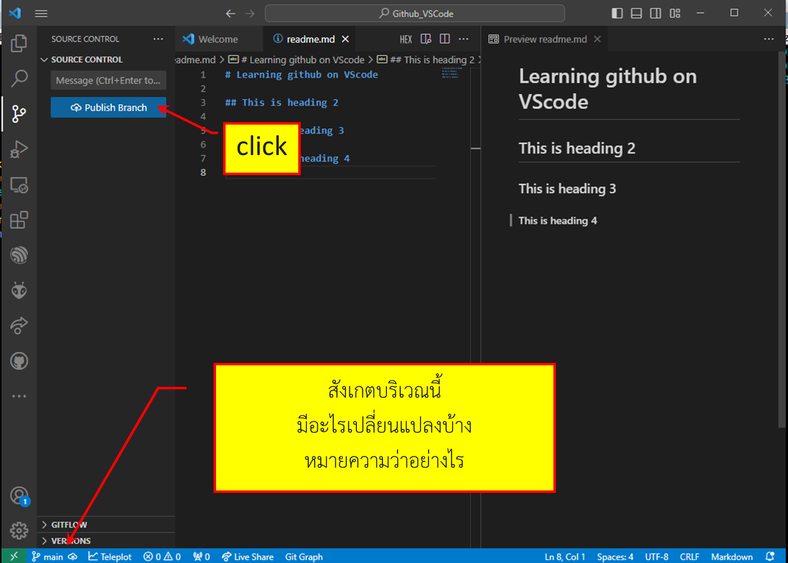

# การใช้งาน Github ร่วมกับ Visual studio code
## แนวทางการทำงานกับ branch

1. สร้าง folder ใหม่เพื่อใช้เป็น local repository

[1] คลิกที่ menu

[2] ปิด folder ที่อาจจะเปิดค้างอยู่

[3] เปิด folder ใหม่ (ถ้ายังไม่มี สามารถไปสร้างได้บน file explorer ขณะที่เลือก local fodler)

2. เลือก folder บน harddisk (ถ้ายังไม่มี สามารถสร้างใหม่ได้ตามต้องการ) 

ต้องไม่อยู่ใน folder ที่เป็น local repo อยู่ก่อนแล้ว ซึ่งในกรณีนั้นจะเป็นการสร้าง submodule ซึ่งอยู่นอกเหนือจากขอบเขตของใบงานนนี้

[1] กดปุ่มสร้างไฟล์ใหม่

[2] ตั้งชื่อเป็น README.md

3. เพิ่มเติมเนื้อหาใน README.md และตรวจสอบโดยการ preview

4. ทำให้ folder ที่เก็บ readme.md เป็น local repository  

 
[1] คลิกปุ่ม git

[2] Initialize Repository

5. ใส่ข้อความ commit และกด commit

6. publish branch ขึ้นบน remote 

